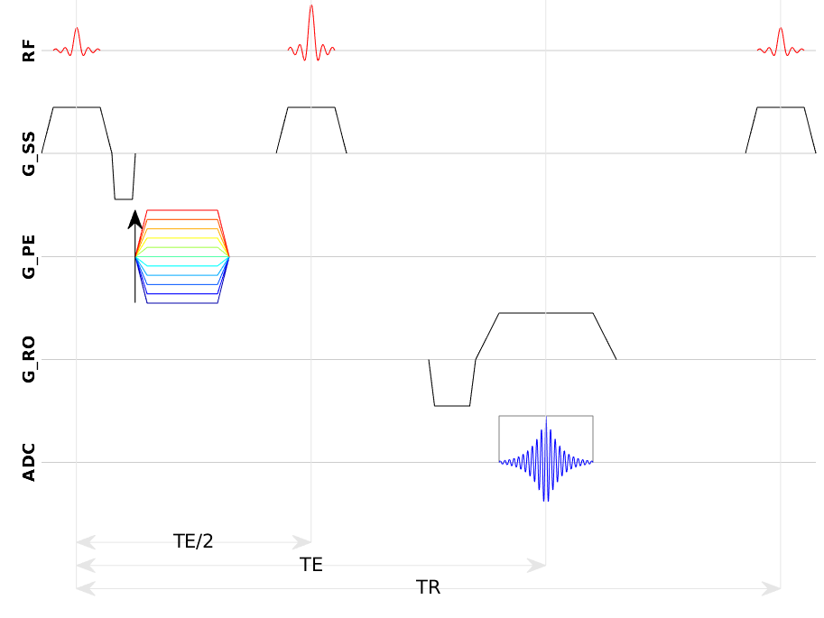
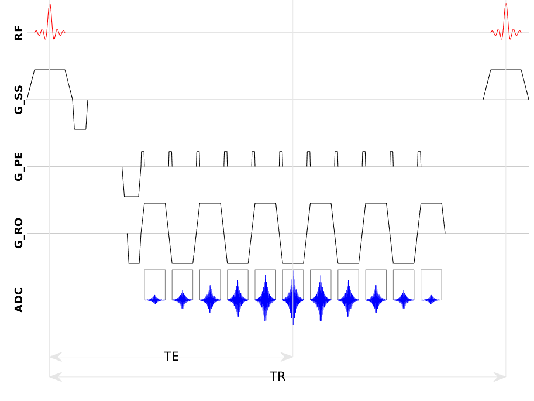

# `mrisd` : MRI sequence diagram

`mrisd` is a library in `MATLAB` designed to draw MRI sequence diagrams.  


## Download and install

`git clone` or download the library, then `addpath` on the main directory. There will be no collition between `mrisd` and existing functions/objects because `mrisd` is a _package_, creating it's own namespace. (https://fr.mathworks.com/help/matlab/matlab_oop/scoping-classes-with-packages.html).


## Features

The library uses `MATLAB` object-oriented-programming.  

There are 5 (+1) logical axes :  
- RF
- Gradient : Slice selection
- Gradient : Phase encoding
- Gradient : Readout
- ADC
- (annotations)

Each "gradient" is considered as a single **lob**, controlled using a single object : if you want to draw 2 lobs, such as SliceSelection_**Setter** and SliceSelection_**Rewinder**, they are 2 different objects.

All gradient lobs are **trapezoidal** : they have a rampup, flattop, and rampdown portions.

Many methods exist for intuitive placement :
```matlab
SliceSelection_Setter.set_flattop_on_rf(RF_90)

SliceSelection_Rewinder.set_onset_at_elem_offset(SliceSelection_Setter);

ADC.set_middle_using_TRTE(RF_090.middle + TE);
```

A system of **block** allows easier drawing for repetitive patterns, such as **EPI**. See example bellow.

Most features are describes in the examples bellow.


## Limitations

I found the "annotations" not very pleasing. For the moment, they are considered as objects, exactly just likes the other RF, gradient, ADC, elements. Maybe there is a better strategy... I'm opened to suggestions.

## TODO
- add more methods for objects placmeent
- change gradient objects behaviour : for the moment, there are by default defined using ratios between flattop and rampup/rampdown so they look like trapeze. An option to force flattop=0 and make them lool like triangles is to come.
- better annotation system
- more blocks (just EPI for now)
- different paradigm for gradient lobs : they do **not** represent real gradient moments, whoever, in MRI physics, it's the **A**rea**U**nder**C**urve (integral) that matters. A method to set SliceSelection_**Rewinder** AUC half the SliceSelection_**Setter** would be welcome.
- different RF pulse shapes (just sinc for now)
- draw a kind of rectangle arround a "block" (like EPI) to show it's a whole block

# Examples

## Spin echo

[example_mrisd_spin_echo.m](example_mrisd_spin_echo.m)  
  


## Gradient Echo EPI

[example_mrisd_gre_epi.m](example_mrisd_gre_epi.m)  
  


# External dependency ?

None


# Tested on

R2017b+


# Python alternatives

https://github.com/lamyj/mrsd
